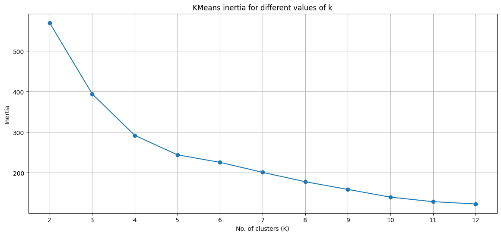
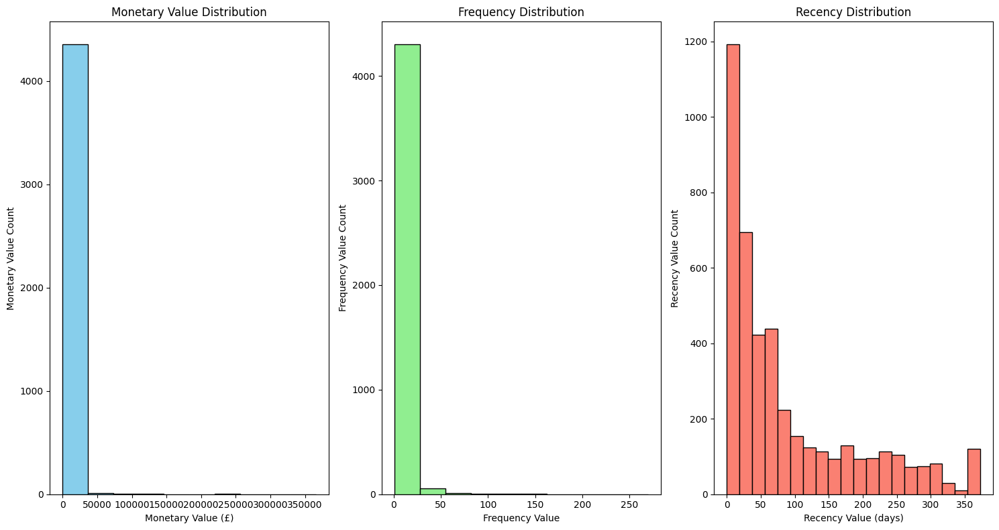
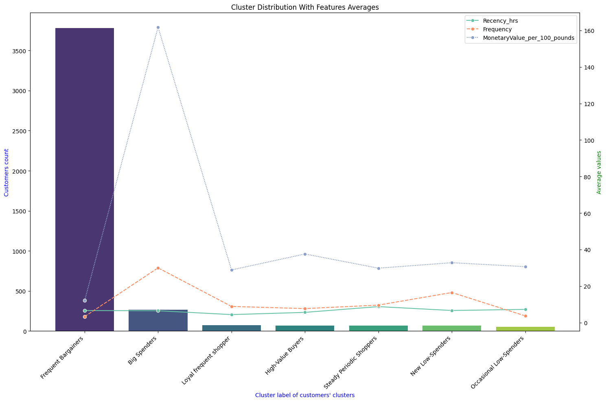

# Customer clustering for RFM analysis

In this project of mine I've performed RFM for the online retail store customers using `KMeansClustering`. The analysis was subjected to consideration of granularity while doing ecommerce, such as purchase during hours or days.

## Need of granularity

The granularity is required to make sure that analysis cover the fine details, often comes up when you process data - it all depends on what level of granularity you want to understand and interpret your data.

## My approach

For RFM analysis of ecommerce; recency should be done in hours, because most of the time the purchase may occur on a similar day, but on different time. I did followed your approach, got 0 in more than 70--80 rows as recency, the reason behind was that a lot of purchases happened at the maximum date's date, but on different hours, then I shifted my approach to hours.

I used `recency_hrs`, and as a result I found out that a lot of low monetary, high frequency and high recency purchases had occurred within the same days but on different time, the day was the max day i.e., 2010-12-09,  cause, december is the season of christmas.

## Learning resource

* [Full RFM project](https://youtu.be/afPJeQuVeuY?si=i9FtDZaVp7r_nWBu "Video")

### My take on the project

But my take on this project was different from the tutorial provided earlier. Since I've already provided details about my method earlier, the reason for this methodollogy of mine is that in real life, for high-activity days like Boxing Day, Eid-ul-Fitr, Diwali, etc., when shopping spikes on platforms like Daraz, Amazon, and Flipkart. Those "0" recency values with the day-level approach can be misleading, making customers look inactive when, in fact, they're highly engaged within short intervals.

## Results

